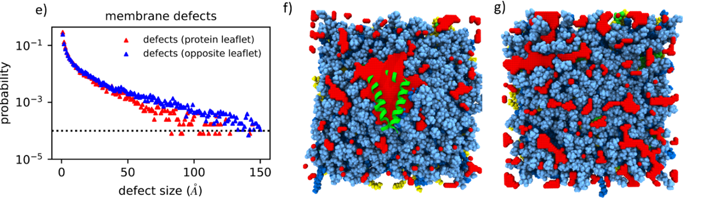

.. packing_defect documentation master file, created by
   sphinx-quickstart on Thu Mar 15 13:55:56 2018.
   You can adapt this file completely to your liking, but it should at least
   contain the root `toctree` directive.

Welcome to packing_defect's documentation!
=========================================================

Analyze membrane packing defects from molecular dynamics trajectories using a fast, grid‑based stamping approach with connected‑component clustering. The toolkit classifies atoms into defect types, writes per‑frame outputs, and summarizes defect size distributions for quick insight.

.. toctree::
   :maxdepth: 2
   :caption: Contents:

   getting_started
   user_guide
   api

Indices and tables
==================

* :ref:`genindex`
* :ref:`modindex`
* :ref:`search`
